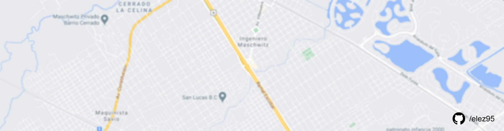
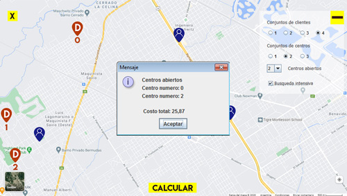
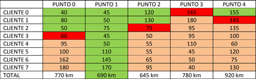
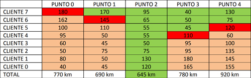

# Facility Location

El siguiente proyecto consiste en implementar un algoritmo goloso para una variante del problema <i>facility location</i>.

Un algoritmo goloso es el resultante de la búsqueda de optimización a problemas con alto nivel de complejidad computacional. Es un enfoque eficiente donde se busca encontrar la mejor solución posible a un problema dado. Los algoritmos golosos son útiles para encontrar una solución rápida y aproximada, pero no siempre garantizan la solución óptima.

Facility location es un problema recurrente en las operaciones y la logística. Se investiga la decisión de dónde ubicar una serie de instalaciones (almacenes, centros de distribución, fábricas, hospitales, etc) en un espacio geográfico para optimizar ciertos objetivos, como la reducción de costos operativos.




## Tabla de Contenidos

- [Introducción](#introducción)
- [Algoritmo](#algoritmo)
- [Clases](#clases)
- [Logros](#logros)
- [Instalación](#instalación) 

## Introducción

Tenemos un conjunto C de clientes que debemos atender, cada uno geo localizado con su latitud y longitud. Tenemos también un conjunto D de puntos donde podemos ubicar centros de distribución para los clientes. Estos puntos también están geo localizados con su latitud y longitud. Finalmente, tenemos una cantidad k máxima de centros de distribución que podemos abrir. Estos k centros de distribución deben ubicarse en k puntos del conjunto D.

Cada cliente será atendido desde el centro de distribución más cercano, y el costo de atenderlo es igual a la distancia en línea recta entre el cliente y su centro de distribución. El problema consiste en determinar qué subconjunto de k puntos de D se deben seleccionar para abrir centros de distribución, de modo tal que el costo total sea el menor posible.

## Algoritmo

La idea fue crear un algoritmo que vaya recorriendo por cada cliente todos los centros y, en cada recorrido, ir eliminando el centro de mayor distancia del cliente. De esta forma en cada recorrido se va reduciendo la cantidad de centros hasta el número k de centros abiertos que se sugieran.

En esta tabla se ve paso a paso las decisiones que toma el algoritmo. Cada fila es un recorrido que hace el algoritmo, y en cada recorrido elimina el punto de mayor distancia con el cliente del actual recorrido. (en rojo se muestra el centro eliminado en cada recorrido).

Centros que quiero abrir: k = 1 centro.



En este ejemplo, el primer recorrido muestra que el cliente 0 tiene al Punto 3 como el de mayor distancia. Luego, en el segundo recorrido, el cliente 1 recorre todos los puntos menos el excluído (Punto 3), y elimina también el de mayor distancia (Punto 4).

El centro obtenido es el Punto 1 y es el que tiene la segunda mejor distancia entre todos los clientes.

Además, como opción adicional, está la posibilidad de profundizar el resultado con una verificación extra. Esto se consigue recorriendo de forma inversa la lista de clientes con los puntos de los centros para luego comparar los kilómetros de la segunda búsqueda con la primera, y así se toma el resultado con menor distancia. Se tiene que considerar que esta segunda verificación dará a la aplicación un trabajo extra, afectando la optimización deseada, pero ampliando las posibilidades de un mejor resultado.



El centro obtenido es el punto 2 y, comparado con la primer búsqueda, este tiene menor distancia, y además es el mejor resultado de la tabla.

## Clases

### Paquete algoritmos

Contiene la clase Semiverseno que se ocupa de calcular la distancia de coordenadas en un mapa.

### FacilityLocation

Se encarga de obtener y retornar los centros más cercanos para abrir. Además tiene un método que calcula la distancia de un centro con todos sus clientes.

- obtenerCentrosCercanos(int k, ArrayList<Coordenadas> centros, ArrayList<Coordenadas> clientes): Recibe la cantidad de centros que desean abrir, una lista de centros y una lista de clientes.
- obtenerCentrosCercanosInverso(int k, ArrayList<Coordenadas> centros, ArrayList<Coordenadas> clientes): Hace la misma función que el método anterior con la diferencia que realiza el recorrido de clientes de forma inversa, del último al primero. De esta forma se busca un segundo resultado para comparar con el primer método y comparar la mejor discancia total.
- sumatoria(Coordenadas centros, ArrayList<Coordenadas> clientes): Recibe un centro con una lista de clientes y calcula la distancia total del centro con todos los clientes.

### Principal

Es la clase intermediaria entre el código de negocio y la interfaz visual.

- hacerBusquedaIntensiva(int k, ArrayList<Coordenadas> centros, ArrayList<Coordenadas> clientes): Su función es comparar el método obtenerCentrosCercanos y el método obtenerCentrosCercanosInverso. Compara sus distancias totales y se queda con la menor. Este método está programado de manera opcional.
- costoTotal(ArrayList<Coordenadas> clientes, ArrayList<Coordenadas> centros): Calcula la distancia total en kilómetros de los centros con todos los clientes. Este método es utilizado principalmente para calcular la distancia total obtenida de los clientes con todos los centros abiertos.

### Coordenadas

Es la clase que se encarga de estructurar la forma de ingresar los puntos en el mapa. Un punto en el mapa tiene una latitud, una longitud, y un valor para identificar el punto ingresado. Las clases Cliente y Centro heredan de esta clase.

### Paquete imagenes

Es el repositorio del proyecto donde se guardan todas las imágenes utilizadas en la interfaz visual.

### Paquete interfazVisual

Contiene las clases de la interfaz visual de la aplicación y la clase que carga los archivos con las coordenadas de los clientes y los centros de distribución.

### Mapa

La interfaz está compuesta por un mapa fijo de una parte de la zona norte de Buenos Aires. También tiene un menú para configurar el conjunto de clientes y centros que se quiere calcular.

En total hay cuatro conjuntos de clientes, tres conjuntos de centros de distribución, una opción para elegir cuántos centros abrir y una opción para hacer una búsqueda intensiva. Teniendo en total una amplia cantidad de variantes para calcular.

La opción "Búsqueda intensiva" sirve para hacer una doble búsqueda (la normal y la inversa) para que luego se compare la mejor distancia de los centros con los clientes. Esta opción amplía la posibilidad de encontrar la mejor opción.

### Paquete testUnitarios

Aquí se encuentran los test unitarios del proyecto. Se hicieron pruebas para controlar las funciones de encontrar los centros más cercanos y para controlar la fórmula del semiverseno.

## Logros

El principal desafío de este proyecto fue encontrar el algoritmo apropiado que cumpla con la optimización necesaria que un algoritmo goloso requiere, y que a su vez obtenga un resultado apropiado. De esta forma, mediante el algoritmo que desarrollé pude ser capaz de dar un resultado óptimo en cuánto a la baja complejidad computacional y a un resultado favorable.

También pude profundizar conceptos de testing unitario, que sirve para dar robustez y seguridad al código del proyecto.

## Instalación

```shell
-- en el directorio donde quieras el proyecto
git clone https://github.com/elez95/Facility-Location.git
```


